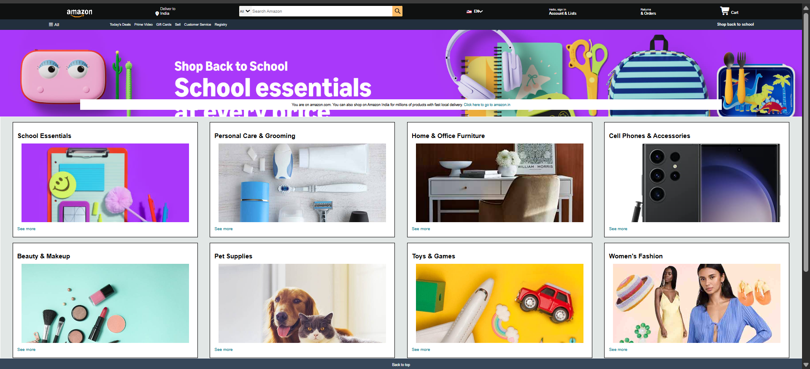
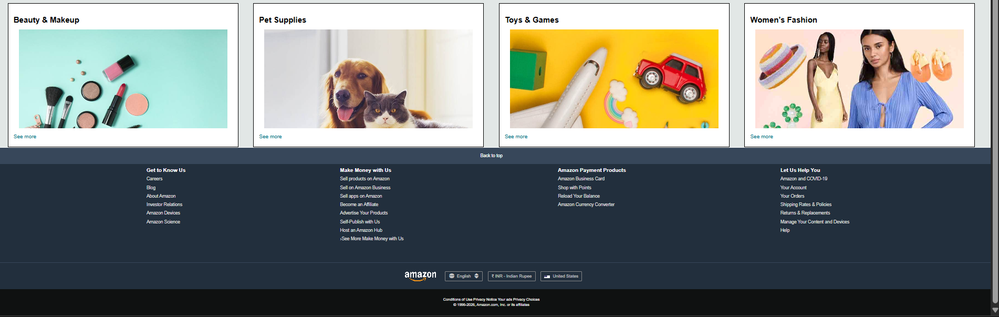

<h1 align="center">🛒 Amazon Clone</h1>

<p align="center">
A responsive Amazon Homepage Clone built using HTML5 & CSS3.
</p>

<p align="center">


</p>

---

# 📖 About

This project is a front-end clone of the Amazon homepage developed using HTML and CSS.

The objective of this project was to improve frontend development skills by recreating one of the world's most popular e-commerce websites.

---

# 📸 Project Preview

## 🏠 Homepage



---

## 📄 Footer



---

# ✨ Features

✅ Amazon Inspired UI

✅ Responsive Navigation Bar

✅ Search Bar

✅ Hero Banner

✅ Product Categories

✅ Shopping Cards

✅ Footer

✅ Clean Design

---

# 🛠️ Technologies

- HTML5
- CSS3
- Font Awesome

---

# 📂 Folder Structure

```text
Amazon Clone
│
├── index.html
├── style.css
├── README.md
│
├── images
│
└── screenshots
      ├── homepage.png
      └── footer.png
```

---

# 🚀 How to Run

Clone this repository

```bash
git clone https://github.com/YourUsername/Amazon-Clone.git
```

Open

```
index.html
```

or

Run using Live Server.

---

# 🎯 Learning Outcomes

- HTML
- CSS
- Flexbox
- Responsive Layout
- UI Design
- Positioning
- Cards
- Navigation
- Footer Design

---

# 🔮 Future Improvements

- JavaScript
- Login Page
- Dark Mode
- Shopping Cart
- Search Functionality
- Mobile Responsive

---

# 👩‍💻 Author

### Arushi Kamboj

B.Tech CSE Student

Frontend Developer

---

# ⭐ Star this Repository if you like it.